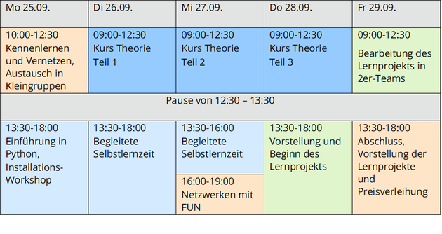

# Summerschool Python Remote für Ingenieurinnen (SPRING2023)

Dieses Repo enthält das Material der ["Summerschool Python Remote für Ingenieurinnen 2023](https://tu-dresden.de/ing/maschinenwesen/ifww/biomaterialien/forschung/korrosion-und-oberflaechen/summerschool).

Alle Rechte liegen bei den Autor:innen.

 
Es folgt der archivierte Inhalt der Übersichtsseite:
 

## Python Summerschool für Ingenieurinnen 2023
### Zeitlicher Ablauf der Python Summerschool vom 25.09.-29.09.

 

### Ziel

Python hat sowohl im Maschinenwesen, im Bauingenieurwesen, der Elektrotechnik, im Data Science und anderen Ingenieur- und naturwissenschaftlichen Disziplinen in den letzten Jahren deutlich an Beliebtheit gewonnen. Bei der SPRING Summerschool möchten wir Studentinnen, Promovendinnen, Wissenschaftlerinnen und berufstätigen Ingenieurinnen die Möglichkeit geben, auszutesten, ob sich mit der Programmiersprache Python die fachlichen Herausforderungen in Studium und Beruf vielleicht besser oder schneller lösen lassen und ihnen die Möglichkeit geben, sich ganz allgemein über das Programmieren auszutauschen. Bitte beachtet, die "Python Summerschool für IngenieurInnen" findet ausschließlich in deutscher Sprache statt, wobei Fragen natürlich auch auf Englisch gestellt werden können.

Die Inhalte der Summerschool basieren vorrangig auf dem Buch [Python für Ingenieure](https://python-fuer-ingenieure.de) und unsere DozentInnen [Carsten Knoll](https://wwwpub.zih.tu-dresden.de/~knoll/index.html) und Dorothea "Piko" Koch werden sich mit Euch mit folgenden Themen beschäftigen:

- Interaktives Arbeiten mit Jupyter Notebooks
- numerisches Rechnen mit Numpy
- 2D-Visualisierung mit Matplotlib
- symbolisches Rechnen mit Sympy
- Datenverarbeitung und -analyse mit Numpy und Pandas
- Simulation dynamischer Systeme mit scipy integrate
- Optimierung mit scipy optimize
- sowie weiteren Themen nach Interesse (z.B. Ansteuerung externer Geräte und Hardware, Signalverarbeitung, 3D-Visualisierung, Wissensrepräsentation, ...)

Unser Ziel ist es, dass Ihr am Ende in der Lage seid, Python selbstständig auf einfache und anspruchsvollere ingenieurwissenschaftliche Fragestellungen anwenden zu können.
Teilnahme

Wenn Ihr an der kostenlosen Online-Summerschool teilnehmen wollt, meldet Euch bitte bis zum 01.09.2023 per Online-Formular zu unserer Veranstaltung an, je nach Anzahl der Anmeldungen melden wir uns zeitnah nach dem 01.09.2023 zurück, ob Ihr einen Platz ergattert habt, auf der Warteliste seid, oder leider bis zur nächsten Summerschool warten müsst.

Um das Optimum aus der Kurszeit herauszuholen, werden wir in der Summerschool nicht bei Null anfangen, sondern Grundkenntnisse in Python voraussetzen. Um herauszufinden, ob der Kurs gut für Euch funktionieren wird, haben wir ein [Quiz](https://codequiz.org/quiz/test/46/) für Euch und uns zur (Selbst)Einschätzung gebaut. Das ist nicht ganz einfach, aber ihr könnt es beliebig oft durchführen und mithilfe der angezeigten Lösungen aus euren Fehlern lernen. Am Ende wird euer Ergebnis in einem String codiert, den ihr im Anmeldeformular mit eintragen müsst.

Falls ihr noch gar keine Python-Erfahrung habt, dann ist das auch kein Problem. Schaut euch einfach die unten verlinkten Tutorials an (plant ein bisschen Zeit ein) und macht dann das Quiz. Wenn Ihr dann während des Kurses doch mal eine Grundlagenfrage habt, von der Ihr glaubt, Ihr müsstet sie eigentlich beantworten können, fragt bitte trotzdem! Niemand weiß wirklich alles.

 

### Installation von Python

Eine mögliche Hürde ist erfahrungsgemäß das Installieren der benötigten Software (Python-Interpreter + Editor) auf dem eigenen Rechner. Für die Vorbereitung (Ausprobieren von Tutorial-Code) ist [Thonny](https://thonny.org/) die einfachste Lösung. Im Kurs werden wir diesen aber nicht nutzen, sondern die Jupyter-Notebooks im Browser, was jedoch etwas aufwändiger in der Installation ist.  Für alle, die beim Installieren Unterstützung brauchen, bieten wir am 1. Kurstag (25.09.) einen Installationsworkshop an. Wir bitten Euch aber, es vorher selbst einmal zu probieren, damit wir uns beim Helfen auf die kniffligen Fälle konzentrieren können. Hierfür am besten die Anaconda-Python-Distribution installieren ([Variante 1 (ca. 800MB)](https://www.anaconda.com/download#downloads), [Variante 2 (60MB + manuelles Nachinstallieren)](https://repo.anaconda.com/miniconda/)), da ist Jupyter dabei bzw. mittels `pip install notebook` installierbar, siehe auch [jupyter.org/install](https://jupyter.org/install).

 

### Empfohlene Python-Tutorials

Kurz, einfach und interaktiv, aber umfasst nicht ganz alle Themen, die zum Lösen des Quiz notwendig sind: https://cscircles.cemc.uwaterloo.ca/de/

Sehr gründlich und umfangreicher als zur Vorbereitung notwendig, wirkt aber etwas trocken: https://openbook.rheinwerk-verlag.de/python/

Ausführlich und interaktiv, aber Englisch: https://www.w3schools.com/python/default.asp

---

Die Summerschool wird gefördert aus Strategiemitteln des Bereichs Ingenieurwissenschaften der TU Dresden.

