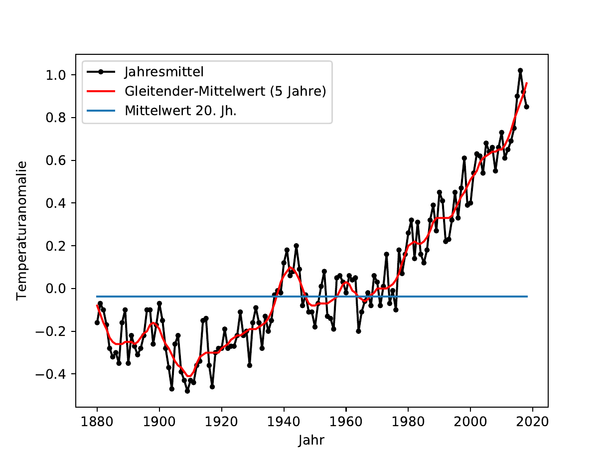
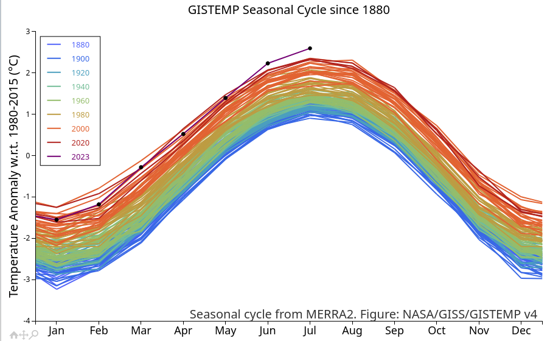

# Aufgaben für das Selbstlernprojekt

## Aufgabe 1 ("Aufbaugegner")

Reproduzieren Sie die folgende Grafik, welche auf die Entwicklung globalen der Jahresmitteltemperatur und einen gleitenden Mittelwert über 5 Jahre zeigt (Datenquelle <https://data.giss.nasa.gov/gistemp/graphs>):

Schritte:

1. Laden sie die Quelldaten im CSV-Format herunter: (CSV $\\hat =$ Comma Separated Values).
2. Öffnen Sie die Datei mit einem Texteditor und verschaffen Sie sich einen Überblick über die Daten.
3. Laden Sie die Daten mit Hilfe von `numpy.loadtxt(...)`. Setzen Sie die Schlüsselwort-Argumente `delimiter` und `skiprows` basierend auf Ihren Ergebnissen von Aufgabe 2 ein. Siehe auch [Doku zu](https://docs.scipy.org/doc/numpy/reference/generated/numpy.loadtxt.html)`loadtxt`.
4. Teilen Sie die geladenen Daten (shape = (139, 3)) auf drei 1d-Arrays der Länge 139 auf. Hinweis: Bei einer Mehrfachzuweisung wie z.B. `a, b = arr2d` wird ein Array *zeilenweise* entpackt. Ggf. ist ein Transponieren ihres Datenarrays hilfreich.
5. Stellen Sie die entsprechenden Zeitreihen grafisch dar.
6. Bestimmen sie mit Hilfe der Funktion `numpy.mean(...)` den Mittelwert aller Jahres-bezogenen Werte über das 20. Jahrhundert. Überlegen Sie dazu welchen Start- und welchen End-Index sie benötigen.
7. Zeichnen Sie auch den Gesamt-Mittelwert in das Diagramm ein (siehe Vorgabe). Beachten Sie folgende Hinweise:
   - Zum Plotten muss die Länge der $x$-Daten und $y$-Daten übereinstimmen.
   - Ein Array `arr_c` der Länge `n` lässt, welches für jeden Index den gleichen Wert `c` hat, lässt z. B. folgendermaßen erzeugen: `arr_c = numpy.zeros(n) + c`. Siehe auch „Broadcasting" in den Kursfolien

### Ergänzungsmöglichkeiten:

- Der gleitenden Mittelwert wurde bisher direkt aus der Quelldatei gelesen (Spalte 3). Berechnen Sie nun diesen Verlauf selbst für unterschiedliche "Fensterbreiten". 
  - Such-Hinweis: "numpy floating mean"
- Führen Sie eine lineare und eine quadratische Regression der Daten durch und nutzen Sie das Ergebnis, um jeweils die globale Temperatur im Jahr 2030 und 2050 "vorherzusagen".
- Erzeugen Sie durch geeignete Wahl der Achseneinteilung eine Grafik, die weniger dramatisch aussieht, ggf. mit fallendem Trend

## Aufgabe 2 ("Fortgeschritten")

Reproduzieren Sie mit Python auf Basis [dieses Datensatzes](https://data.giss.nasa.gov/gistemp/graphs/graph_data/GISTEMP_Seasonal_Cycle_since_1880/graph.csv) folgende Grafik:

Herausforderung: Farbverlauf entsprechend Legende

### Ergänzungsmöglichkeiten

- Erstellen Sie eine Animation: Für jeden Datenpunkt (jeder Monat) wird ein eigenes Bild gespeichert. Diese werden dann zu einem Video zusammengefügt. Dadurch sieht man wie sich die Kurven über die Jahre immer weiter nach oben verschieben. Herausforderungen: Konsistenter zoom über alle Einzelbilder, Legende,
- Wählen Sie einen Monat (z.B. Juli) und plotten Sie den Verlauf für jedes Jahr in dem Monat.
- Finden Sie durch geeigneten Pythoncode den Monat mit der stärksten Erwärmung und überprüfen Sie das Ergebnis visuell.

## Aufgabe 3 ("Profi")

Sucht Euch einen Datensatz aus Eurem Fachgebiet oder Interessenbereich, "verdichtet" die Informationen geeignet und baut eine Visualisierung, die bestenfalls eine Schlussfolgerung erlaubt oder Erkenntnis bringt.

Mögliche Datenquellen:

- https://opendata.dwd.de/climate_environment/CDC/regional_averages_DE/monthly/air_temperature_mean/ 
  - Klimadaten seit 1981
  - übersichtliche CSVs
- https://www.openagrar.de/receive/openagrar_mods_00054877 
  - Substanz auf dem Boden:
  - als Excel Daten zum Download
- https://opendata.dwd.de/climate_environment/CDC/regional_averages_DE/annual/ 
  - Durchschnittliche Kalte Tage, Sommertage, etc. jährlich für ganz Deutschland:
  - Viele verschiedene CSVs, könnte interessant sein, die miteinander in Beziehung zu setzen
- https://www.ufz.de/index.php?de=37937 
  - Niederschlag, Verdunstung und Bodenfeuchte
- https://www.data.gv.at/auftritte/?organisation=stadt-wien 
  - Daten über die Stadt Wien
  - Viele verschiedene Daten → kann sehr interessant sein
  - Es müssen die richtigen Daten gefunden werden
